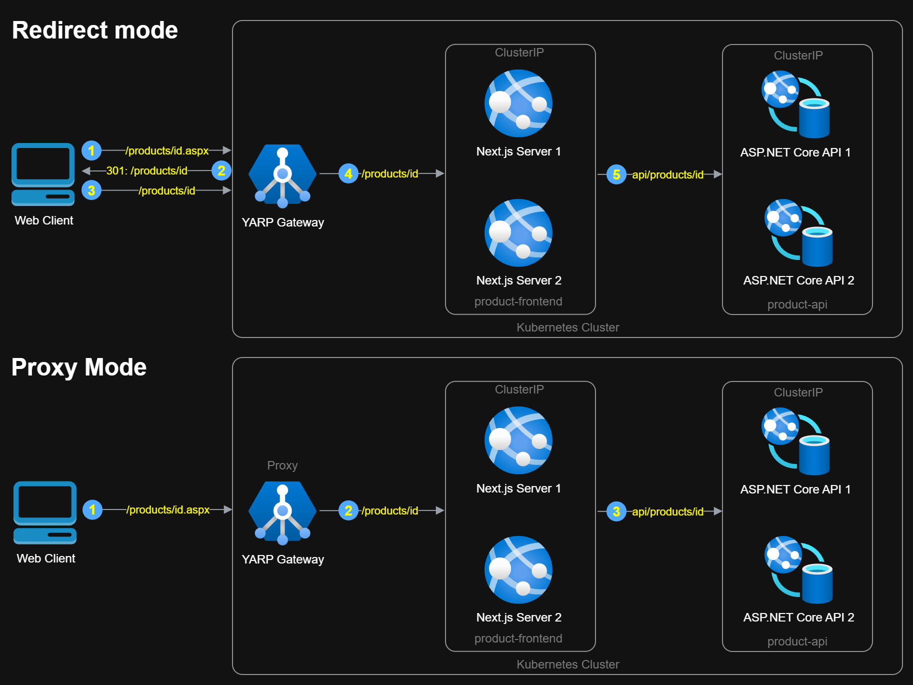

# Product Inventory System with Redirect & Proxy Routing

This project was created to **demonstrate two routing strategies — redirect and proxy — for handling legacy URLs** in a modern web architecture. It showcases how to migrate from "legacy" paths to clean, SEO-friendly URLs using a YARP reverse proxy, while maintaining full functionality and user experience. To simplify the demonstration, the old path is taken to be the path with `.aspx` at the end.

The system includes:
- A **RESTful API** built with ASP.NET Core 9
- A **React + Next.js frontend** with server-side rendering (SSR)
- A **YARP gateway** that handles both redirect and proxy modes for legacy URL migration

---

## Routing Modes

The scheme illustrates how requests flow through the system in both **Redirect** and **Proxy** modes.



---

### Redirect Mode

1. **Web Client → YARP Gateway**  
   Request: `/products/id.aspx`

2. **YARP Gateway → Web Client**  
   Response: `301 Redirect → /products/id`

3. **Web Client → YARP Gateway**  
   Request: `/products/id`

4. **YARP Gateway → Next.js Server**  
   Request: `/products/id`

5. **Next.js Server → ASP.NET Core API**  
   Request: `/api/products/id`

> Best for SEO preservation and gradual migration from legacy URLs.

---

### Proxy Mode

1. **Web Client → YARP Gateway**  
   Request: `/products/id.aspx`

2. **YARP Gateway → Next.js Server**  
   Internally rewritten to: `/products/id`

3. **Next.js Server → ASP.NET Core API**  
   Request: `/api/products/id`

> Seamless user experience with no visible redirects. Ideal for full proxying and legacy URL masking.

---

## Features

### Backend (ASP.NET Core 9)
- RESTful API for product management
- In-memory storage (no external DB required)
- Docker-ready for easy deployment

### Frontend (Next.js + React)
- Server-side rendering (SSR) for SEO and performance
- Product listing with pagination and filtering
- Create, edit, and delete products
- Basic input validation
- View detailed product info on a separate page

### Gateway (YARP)
- Centralized reverse proxy for frontend and backend
- Supports both redirect and proxy modes for legacy `.aspx` URLs
- Routing mode controlled via "RoutingOptions" in appsettings.json

---

## Technologies Used

| Layer        | Stack                          |
|--------------|--------------------------------|
| Backend      | ASP.NET Core 9, Entity Framework Core |
| Frontend     | Next.js, React                 |
| Gateway      | YARP (Reverse Proxy)           |
| Containerization | Docker, Docker Compose     |

---

## API Endpoints

| Method | Endpoint              | Description                          |
|--------|-----------------------|--------------------------------------|
| GET    | `/api/products`       | Retrieve all products                |
| GET    | `/api/products/{id}`  | Retrieve product by ID               |
| POST   | `/api/products`       | Create a new product                 |
| PUT    | `/api/products/{id}`  | Update product by ID                 |
| DELETE | `/api/products/{id}`  | Delete product by ID                 |

> Product model includes: `id`, `name`, `description`, `price`, `quantity`

---

## How to Run

### Local Development

1. **Backend**: Run `ProductApi` in Visual Studio or via CLI:
   ```bash
   dotnet run --project ProductApi
   ```

2. **Frontend**: Start Next.js app:
   ```bash
   cd product-frontend
   npm install
   npm run dev
   ```

3. **Gateway**: Run `ProductGateway`:
   ```bash
   dotnet run --project ProductGateway
   ```

---

### Docker Deployment

Run all services (API, frontend, gateway) with one command:

```bash
docker-compose up --build
```

Access the app via:

- **Gateway**: `http://localhost:7045`
- **Frontend**: `http://localhost:3000`
- **API**: `http://localhost:5001`

---

## Project Structure

```
├── ProductApi/           # ASP.NET Core backend
├── product-frontend/     # Next.js frontend
├── ProductGateway/       # YARP reverse proxy
├── docker-compose.yml    # Multi-service orchestration
```

---

## 🧠 Notes

- Legacy `.aspx` URLs are supported via YARP middleware
- SSR ensures SEO-friendly product pages
- Configurable routing logic via "RoutingOptions" in appsettings.json

---

Created by Aleksandr Toroshchin, 2025